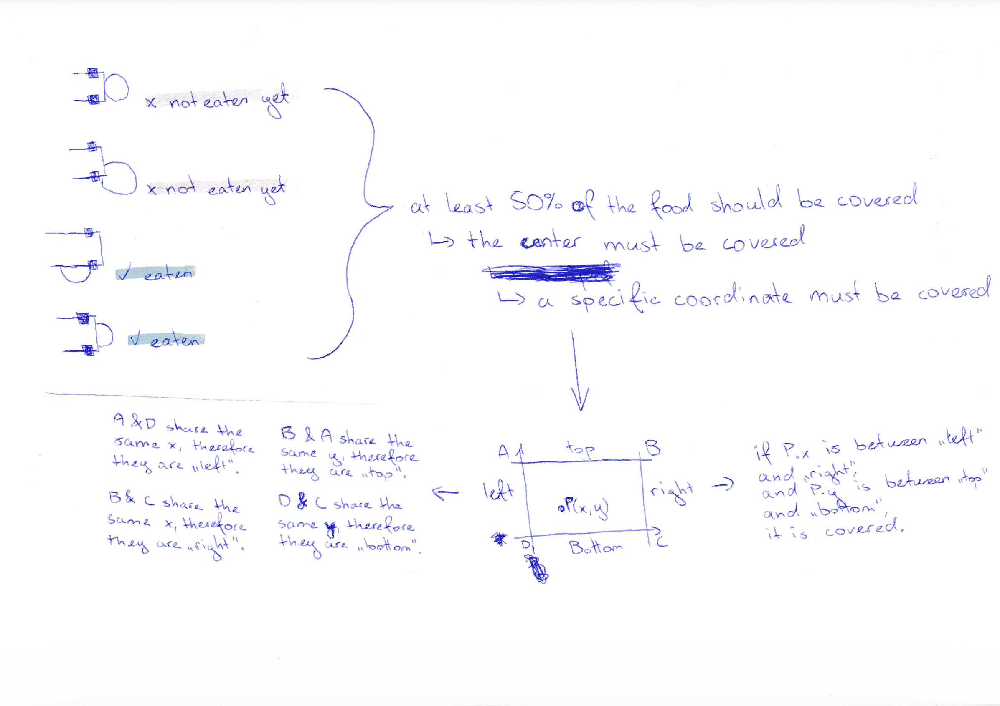
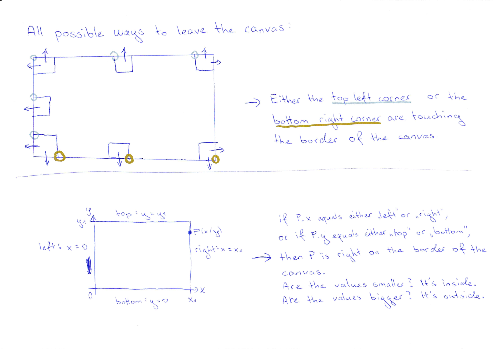
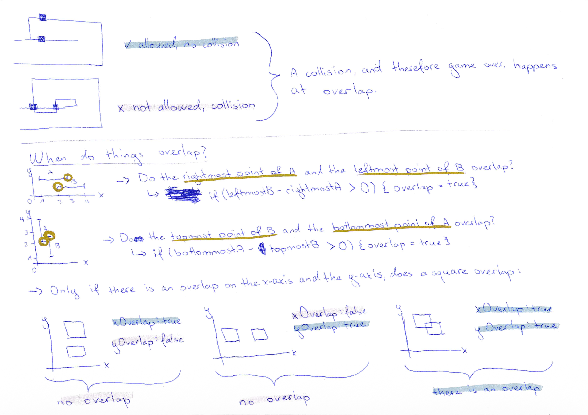

# Collision Detection

## Snake eats food — [`overlapsCoordinate`](./../src/controller/collision-utils.ts)

Food counts as "eaten" once the snake touches its center (which means around 25% - 50% of the food are covered by the snake).

How one can find out when the center (a specific coordinate) is covered by the snake (a tile; or square) is shown in the image below:

## Snake stays inside the playable field — [`isInsideCanvas`](./../src/view/CanvasView.ts)

The snake is not allowed to leave the playable field — the canvas.

The calculation is quite similar to [checking whether a specific coordinate is overlapped](#snake-eats-food--overlapscoordinate), because, essentially, we check whether specific corners of a tile (so a specific coordinate of a square), is still inside the canvas (a square / rectangle).

How the calculation works, is explained in the image below:

## Snake collides with itself — [`overlapsTile`](./../src/controller/collision-utils.ts)

A snake is not allowed to collide with itself.

How one can find out when the body of the snake (a tile; or square) is covered by the head of the snake (another tile; or square) is shown in the image below:

This same calculation is also used to make sure food doesn't spawn inside the snake.
